<picture>
  <source media="(prefers-color-scheme: dark)" srcset="./assets/header-dark.svg">
  <source media="(prefers-color-scheme: light)" srcset="./assets/header-light.svg">
  
</picture>

AI 工程师，2026 届。主力 Python，Rust / C / TypeScript 看场合上场。

我对两个方向感兴趣，它们碰巧在同一个问题上相遇：

**让模型真的干活。** 做 RAG 和 Agent，在乎评估数字而不是 demo 效果。
最近一个企业知识库项目：混合检索（Dense + BM25 / RRF）加重排，全链路用 RAGAS 量化，
端到端延迟从 24.5s 压到 9.93s，recall 0.9898。

**搞清楚模型底下是什么。** 在啃 CUDA、Triton 和 PyTorch internals，
偶尔用 C 从最底层造点东西，免得忘了机器是怎么算账的。

### stack

### 在做的东西

| 项目 | 一句话 |
| --- | --- |
| [KeyVault-AI](https://github.com/NoraStory/KeyVault-AI) | 本地的 AI 密钥与配置管理中枢，Tauri v2 + Rust + Svelte |
| [deepseek-harness](https://github.com/NoraStory/deepseek-harness) | 给 DeepSeek 写的插件化 harness，Everything is a Plugin |
| [AgenticLearningSystem](https://github.com/NoraStory/AgenticLearningSystem) | 本地 agentic 学习系统，陪自己学 C++ 和 Python |
| [algomind](https://github.com/NoraStory/algomind) | 算法练习，Go |

### 写字的地方

[CSDN](https://blog.csdn.net/storyseekee) · [Gitee](https://gitee.com/storyseeker) · [Email](mailto:storyseeker@163.com)

### pulse

  
  
  

<picture>
  <source media="(prefers-color-scheme: dark)" srcset="https://raw.githubusercontent.com/NoraStory/NoraStory/output/github-contribution-grid-snake-dark.svg">
  <source media="(prefers-color-scheme: light)" srcset="https://raw.githubusercontent.com/NoraStory/NoraStory/output/github-contribution-grid-snake.svg">
  
</picture>

---

tools i reach for: FastAPI · LangChain/LangGraph · Milvus · Docker · Tauri
