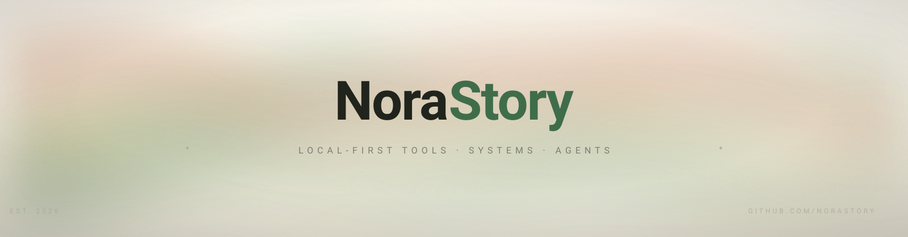

<picture>
  <source media="(prefers-color-scheme: dark)" srcset="./assets/banner-dark.svg">
  
</picture>

我做小而锋利的工具。先给自己的机器用，再给碰巧需要它的人。喜欢贴着底层写代码，也会在问题不在机器本身时坦率地拿起框架。

**常用**

`Rust` `C` `C++` `Go` `Python` `TypeScript` `Svelte` `Tauri`

**做事方式**

- **本地优先**：数据先留在自己的机器上，同步应该是选择，不是默认。
- **读懂源码**：文档描述意图，代码才说真话。
- **三次就重写**：同一个工具烦到我三次，就该重写了。
- **安静软件**：不要遥测，不要弹窗，不要诱导性设计。

**找我**

有 issue 或讨论都可以。回得慢，修得认真。

手工绘制 SVG · 页面不加载第三方统计 · 只留一点动画